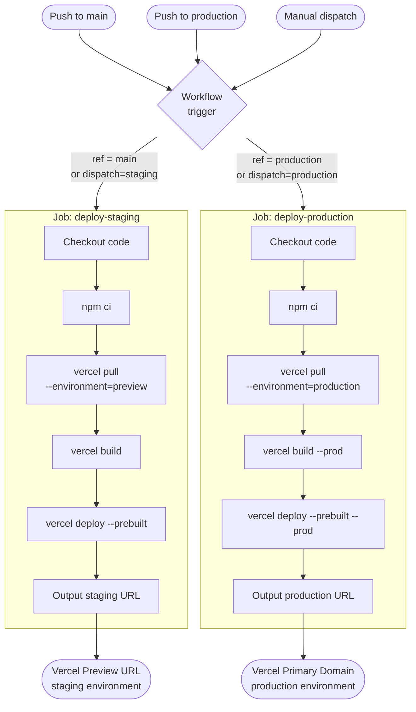

# CI/CD Pipeline

```mermaid
flowchart TD
    A([Push to main]) --> W
    B([Push to production]) --> W
    C([Manual dispatch]) --> W

    W{Workflow\ntrigger}

    W -->|ref = main\nor dispatch=staging| J1

    W -->|ref = production\nor dispatch=production| J2

    subgraph J1[Job: deploy-staging]
        direction TB
        S1[Checkout code] --> S2[npm ci]
        S2 --> S3[vercel pull\n--environment=preview]
        S3 --> S4[vercel build]
        S4 --> S5[vercel deploy --prebuilt]
        S5 --> S6[Output staging URL]
    end

    subgraph J2[Job: deploy-production]
        direction TB
        P1[Checkout code] --> P2[npm ci]
        P2 --> P3[vercel pull\n--environment=production]
        P3 --> P4[vercel build --prod]
        P4 --> P5[vercel deploy --prebuilt --prod]
        P5 --> P6[Output production URL]
    end

    S6 --> E1([Vercel Preview URL\nstaging environment])
    P6 --> E2([Vercel Primary Domain\nproduction environment])
```
